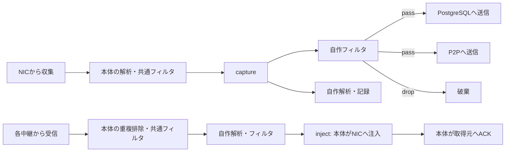

# ブロックを接続して解析・フィルタ・中継を組み合わせる

本体0.4.0の`[pipeline]`では、複数の中継プラグインと自作の解析・フィルタブロックを組み合わせる。設定はTOMLで記述する。既存の`[relay]`による単一中継も利用できる。同時には指定しない。

## 流れと責務



本体はNIC、配送ID、キュー、再試行、ACK、共通フィルタ、グラフの検証を管理する。ブロックが返すのは出力ポートと解析結果だけで、NICやACKのハンドルは渡さない。今回のAPIではフレームの書き換え・生成は扱わない。本体のパーサで拒否される不正なヘッダ・IPフラグメントなどはブロックへ渡さない。

`capture`は本体が収集したフレーム、`<中継ID>.received`はその中継から受け取ったフレーム。`<ブロックID>.<ポート>`から任意の数のブロック・終端へ接続できる。終端は中継ID（送信）と`inject`（NIC注入）。`to=[]`は明示的な破棄を表す。

循環、未定義ポート、未接続ポート、ID重複、到達不能ブロックは起動前に拒否する。全出力ポートの経路を記述し、使わないポートは`to=[]`にする。グラフの合流では各経路の解析結果を別々に処理し、終端では同じフレームを1回だけ配送する。

## 参考ブロックを追加する

`plugins/packet-rules`は自作の参考実装。外側のEtherTypeを判定し、`pass`か`drop`へ流す。フレーム長・EtherType・ラベルを解析結果に追加する。VLAN内部まで調べるフィルタではない。

```bash
cargo build --release --bin amitoki --locked
cargo build --release -p amitoki-block-packet-rules --locked
python3 scripts/package-plugin.py target/release/amitoki-plugin-packet-rules dist/packet-rules
./target/release/amitoki plugin block add ./dist/packet-rules
./target/release/amitoki plugin block describe packet-rules
./target/release/amitoki plugin block configure packet-rules --set log_every=128
./target/release/amitoki plugin block validate packet-rules
cp amitoki.pipeline.example.toml amitoki.toml
./target/release/amitoki --config amitoki.toml --check-config
```

`node_id`と`interface`を自分の環境に合わせ、PostgreSQLの追加・初期化・接続設定は[README](../readme.md)の手順を使う。このブランチの本体を最初にビルドした後は、ブロックだけをビルド・追加・更新できる。本体の再ビルドは不要。稼働中の設定変更・更新・削除は拒否し、再起動後に新しい構成を読み込む。ホットリロードは行わない。

同じプラグインを何個でも無制限に起動するのではなく、上限内で別の`id`として宣言する。各インスタンスは独立したプロセス・設定・状態を持つ。CLIで保存した設定に、そのインスタンスの`options`を項目単位で上書きする。

## 複数の中継を使う

例の`database`に加えてP2Pを宣言し、`outbound.pass`の`to`を`["database", "direct"]`にすると両方へ送る。

```toml
[[pipeline.relays]]
id = "direct"
plugin = "p2p"
[pipeline.relays.options]
listen = "0.0.0.0:7443"
certificate = "/path/to/self.der"
private_key = "/path/to/self-key.der"
[[pipeline.relays.options.peers]]
node_id = "node-b"
address = "192.0.2.2:7443"
certificate = "/path/to/peer.der"

[[pipeline.routes]]
from = "direct.received"
to = ["inbound"]
```

P2Pの証明書・ネットワーク設定は[プラグインの説明](https://github.com/amitoki/amitoki-plugin-p2p)に従う。中継インスタンスの`channel`は省略すると本体の値を使う。同じプラグインを同じ接続先で複数起動する場合は、ノードの占有が衝突しないよう別の`channel`を指定する。接続先やP2Pのlistenポート・証明書は各プラグインの制約に従う。

同報だけでなく、自作ブロックに`database`・`direct`などの出力ポートを定義し、パケットごとに片方を選べる。ポート名は送信先のIDとは独立しており、接続先は本体設定が決める。

## 配送と障害時の動作

- 本体は最大128件のバッチを解析して送信計画を作る。中継への送信は分岐ごとに並行する。失敗した中継だけ同じIDで再試行し、解析や成功済みの分岐は繰り返さない。
- 中継の受け付け成功は対向NICへの到達を意味しない。中継の永続性はプラグインに依存する。両中継への原子的な同時配送でもない。
- 全中継分岐を必須として扱う。1つが停止するとそのバッチは完了せず、後続の配送も待つ。入力キューが埋まると収集を止める。独立した分岐の進行・自動フェイルオーバーは未対応。
- 各中継からの取得は別タスクで行う。同じ中継では、取得したバッチの処理とACKが済むまで次を取得しない。
- NICへの注入・明示的な破棄が終わってから、取得元の中継へそのreceiptを返す。NIC送信が失敗した場合は成功済みの分だけACKする。ACKだけの再試行では再注入しない。
- ブロック障害は既定で`on_error="stop"`となり、中継全体を停止する。観測用の分岐は`drop_branch`にすると、そのブロックで失敗した入力バッチだけを破棄する。他の経路へ勝手に通過させない。タイムアウトまでの待ち時間は他の分岐にも影響する。
- ブロックの解析結果はローカルの次のブロックへだけ渡す。PostgreSQL/P2Pを通して対向ノードへ運ぶメタデータではない。

受信経路ごとの処理完了と、NICで収集・注入したIDを別々の履歴で管理する。各履歴の上限は65536件。別中継から同じIDを受信した場合も、その経路の解析・記録は実行する。NICへの注入だけを共通の履歴で抑制するため、片方で破棄しても別経路の配送は妨げない。履歴はメモリ上なので、再起動・履歴の追い出し後の重複を排除する保証はない。クラッシュをまたぐ解析・記録・NIC注入のexactly-onceも保証しない。

終了時の`publish`は、ブロック構成では「送信計画が完了した収集フレーム数」で、明示的に破棄したフレームも含む。追加の`process`は成功したブロック入力数、`failed_branch`は障害で破棄したブロック入力数、`duplicate`は除外した配送ID数。

## 固定するループ対策と上限

- Linuxの`PACKET_IGNORE_OUTGOING`を常に有効にし、自分がNICへ注入したフレームの再収集を防ぐ。
- ローカルのグラフはDAGに限定する。`capture → inject`、`中継.received → 中継`は途中にブロックを挟んでも拒否する。受信フレームを別中継へ橋渡しする機能は、ホップ情報を運ぶ通信仕様と合わせて今後設計する。
- 中継16個・ブロック32個・経路128個・ポート8個・1入力の最悪展開128回を固定上限とする。解析結果はJSONオブジェクトで4096バイト以内。フレームは最大65535バイト、IPCは最大16MiB。
- 入力キューは`engine.queue_capacity`、各ブロック呼び出しは`operation_timeout_ms`、終了処理全体は`shutdown_timeout_ms`で制限する。既存のEngineConfigの設定上限を使う。これらは本体設定だけで指定でき、ブロックから変更できない。

キューの件数は収集フレームか受信バッチを1件として数える。各中継は最大128フレームのバッチを1つだけ保持し、別途最大128件の処理中バッチと、最大128経路分の解析結果を保持する。フレーム本体は`Bytes`を共有する。外部プロセス自身のメモリ・CPU使用量をこの上限で制限するものではない。

物理L2ループや、別のブリッジから戻って新しいIDを付けられたパケットは、この仕組みだけで止められない。ループのある物理ネットワークでの運用保証は対象外。

## 自作ブロックのAPI

SDK 0.2.0の`amitoki_plugin_sdk::block`を使う。RustのAPIは拡張したが、中継のMessagePack通信仕様v1は維持し、PostgreSQL 0.1.2・P2P 0.1.1をそのまま利用する。

1. `PluginManifest.block`に`BlockDefinition { outputs }`を指定し、設定を`config_schema`へ定義する。
2. `BlockPlugin::connect(BlockContext, options)`でインスタンスを作る。コンテキストには本体のnode/channelとインスタンスIDが入る。
3. `Block::process(&[BlockPacket])`で入力順に同じ件数の`BlockOutput`を返す。入力は読み取り用のFrameと解析結果。出力は`ports`と`annotations`だけ。ポートを空にすると破棄する。
4. `--describe`でマニフェストをJSON出力し、`--stdio`で`serve_block`を動かす。stdoutは通信専用、ログはstderrへ出す。
5. `scripts/package-plugin.py`で配布物を作り、`plugin block add ./dist/PLUGIN`で導入する。GitHub Releaseに同形式の配布物を置けば`plugin block add https://github.com/OWNER/REPOSITORY --version TAG`も使える。

[packet-rulesの実装](../plugins/packet-rules/src/main.rs)が動作する例。IPCの追加メソッドは`connect_block`と`process`、応答は`processed`。長さ付きMessagePackなので、別言語でも実装できる。フレームやIDを出力に追加した応答、未定義ポート、出力件数の不一致、過大な解析結果を拒否する。

## プロセス権限

外部中継・ブロックは起動前にcapabilityのeffective/permitted/inheritable/ambientを空にし、`no_new_privs`を設定する。本体のNICはclose-on-execで、コアプロセスのdumpableも無効にする。raw socket権限を持つ親からの起動を隔離コンテナで試験する。

`no_new_privs`の意味は[Linuxカーネルの説明](https://docs.kernel.org/userspace-api/no_new_privs.html)に従う。これは完全なサンドボックスではない。プラグインは同じUID・環境変数・ファイルシステムへのアクセスを持ち、一般のネットワーク接続もできる。信頼できるプラグインを専用の非rootサービスユーザで実行する。悪意あるプラグインの封じ込めには、別UID・名前空間・seccomp等を組み合わせる追加設計が必要。

## VMで再現する

```bash
scripts/vm-lab up --relay both --pipeline
scripts/vm-lab test --relay both --pipeline
```

3台にPostgreSQL・P2Pと3個のpacket-rulesインスタンスを配備する。ICMP/TCP/UDP、停止後の再配送、使用中の更新・削除拒否、本体バイナリ不変を調べる。実験用EtherTypeの通過・拒否と、両経路からの同じIDがNICへ重複注入されないこと、各子プロセスのcapability消去も確認する。

`--relay postgres --pipeline`と`--relay p2p --pipeline`で単独中継も試せる。従来の構成は`--relay postgres --no-pipeline`または`--relay p2p --no-pipeline`。PCAPによる単体テスト・経路トレースは[開発・デバッグ手順](plugin-development.md)を参照する。GUI・Webエディタ、パケット改変、経路ごとの永続チェックポイント、最大帯域測定は未実装。
