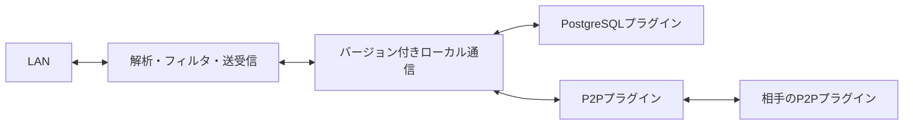

# 中継方式をプラグインとして追加する

0.1.0の複数中継・解析・フィルタの接続は[ブロック構成](block-pipelines.md)を参照する。このページは中継プラグインのpublish/receive/acknowledge境界を説明する。

amitokiはEthernetフレームを中継する。DBへの保存方法、メッセージキューの使い方、別プロセスとの通信方式は、中継プラグインが決める。パケットの解析・フィルタ・NICへの送受信はコアが担当する。

本体は`crates/relay`のpublish・receive・acknowledgeだけを使う。外部プラグインは独立した実行ファイルで、インストール後に本体を再ビルドする必要はない。



## 配布・設定・通信を分ける

開発用の`plugins/postgres`と`plugins/p2p`はamitoki Organizationの公開リポジトリのsubmodule。実行時はGitHub Releaseかローカル配布物からインストールし、開発用のsubmoduleは参照しない。親リポジトリはGitのコミットを固定し、各プラグインは共通SDKのGit revisionとCargo.lockを固定する。

配布物の`plugin.json`に名前、バージョン、OS・CPU、実行ファイル名、SHA256、通信仕様、JSON Schemaを持たせる。本体はプラグインごとの設定項目をハードコードしない。設定の型・必須条件・説明・既定値はプラグイン側が定義する。CLIの設定は次回起動時に反映し、実行中の無停止切替は行わない。

通信仕様v1はstdin/stdoutの長さ付きMessagePack。stdoutをログへ使わずstderrへ出す。`describe`でインストール済み定義と実行ファイルを照合してから、`connect`へnode_id・channel・設定を渡す。詳細は[SDKの通信仕様](../crates/plugin-sdk/README.md)。Rustの共有ライブラリABIには依存しない。

| API | 責務 |
| --- | --- |
| publish | フレームをバッチで受け付ける。同じIDの再試行を扱う |
| receive | ACKされていないフレームを非破壊で取得する |
| acknowledge | NICへの送信またはフィルタ拒否が完了した受領情報を記録する |

UUIDは収集時に一度生成し、再試行でも維持する。`Receipt`はプラグインが発行する不透明な文字列。本体は中身を解釈しない。同じUUIDを異なる内容へ使い回してはいけない。

1回128件、メッセージ16MiBで制限し、本体は大きいバッチを分割する。専用タスクが要求と応答を対応付けるため、呼び出しキャンセル時に次の要求へ前の応答が混ざらない。IPCが30秒で完了しない、または子プロセスが終了した場合は本体へ停止が必要なエラーを返す。状態を失う自動再接続はせず、systemd等で中継全体を再起動する。

プラグインは利用者が信頼した実行ファイルとして動き、サンドボックスではない。保持期間、永続性、再送の重複除去範囲は各実装が文書化する。

## 新しいプラグインを追加する

1. 独立したリポジトリで`RelayPlugin`と`Relay`を実装する。
2. JSON Schemaを含む`PluginManifest`を定義し、`--stdio`でSDKの`serve`、`--describe`で定義のJSONを返す。
3. releaseビルド後に`scripts/package-plugin.py <実行ファイル> <出力先>`で配布物を作る。
4. `amitoki plugin add --path <出力先>`で追加し、設定検証と通信試験を行う。

本体のCargo.tomlやプラグイン登録コードを変更する必要はない。privateリポジトリからCLIで取得する場合は`AMITOKI_GITHUB_TOKEN`または`GH_TOKEN`を設定する。

## P2Pは相互認証したQUICで直接送る

接続先ごとに信頼する証明書とnode_idを固定する。接続後も証明書がそのnode_idに対応するかを照合し、別channelのフレームを拒否する。ローカルの同一ユーザではchannel/node_idをファイルロックで占有する。別マシンへ同じ秘密鍵とIDを複製して動かすことは禁止する。

各ノードが全接続先へ送るため、転送済みフレームを別ノードがさらに中継するmesh routingは行わない。受信キューは4096件・64MiBが既定の上限。ACK後の直近65536件を重複除去する。キューと重複情報はメモリにあり、プロセス再起動で失われる。

Next.jsの接続情報交換サーバを指定すると、認証付きHTTPSでIP・ポート・証明書のfingerprintだけを登録・取得する。共有状態はRedisに置き、60秒の有効期限を15秒ごとに更新する。本体のパケットはQUICで直接送り、このサーバを通さない。交換サーバが停止しても、取得済みのアドレスで直接通信を続ける。

この版は相互に到達できるUDPアドレスを前提にする。NATの自動hole punching・STUN/TURN・ブラウザのWebRTCクライアントは未実装。Vercelへ置くだけでNAT制限を解消するわけではない。

## PostgreSQLはノードごとの未処理キューを持つ

`plugins/postgres`にSQL、TLS、接続プール、ノードの登録をまとめた。TimescaleDB拡張は必須ではなく、通常のPostgreSQLで動く。旧版のパケットログ用テーブルはこのプラグインから参照しない。

- `frames`: フレーム本体。`(channel, id)`の一意制約で送信再試行を重複させない。
- `nodes`: 登録ノード。再起動後も同じIDを使う。
- `pending`: ノードごとの未処理フレーム。送信成功後のACKで該当ノードの行だけを削除する。

バッチ保存と各ノードの`pending`作成は同じトランザクションで行う。新規ノード登録と送信が交差しても欠損しないよう、同じchannelでは登録・保存をトランザクション単位のadvisory lockで直列化する。取得とACKはこのロックを取らない。

同じchannelの複数送信元はこのロックを共有するので、書き込みを無制限に並列化する設計ではない。複数channelは独立して進む。大規模な負荷でこのロックが支配的になった場合は、別プラグインやノード登録方式の見直しを検討する。

受信時は`pending`を順に読む。時刻や最大IDを「ここまで処理済み」というカーソルに使わないため、同時刻のデータや遅れてコミットされたデータを取りこぼさない。PostgreSQLのシーケンス値はコミット順を表さないため、単にtimestampを連番へ置き換えるだけでは不十分だった。[PostgreSQLの分離レベル](https://www.postgresql.org/docs/current/transaction-iso.html)

初回登録では`replay_window_ms`以内の既存フレームも取り込む。再起動時は未処理キューを引き継ぐ。新規データだけにする場合は初回登録時の`replay_window_ms`を0にする。

接続プールは規定で4接続まで。これとは別に、ノードの多重起動を防ぐ専用接続を1本持つ。この接続が切れた場合はノード占有を確認できないため停止する。再起動すると未処理キューから再開する。TLSはOSのルート証明書で検証し、明示した`sslmode=disable`以外は平文へ切り替えない。

## 障害時の保証と運用上の制約

保存済みの未処理フレームは、ACKされるまでキューに残る。ただし、NICへの注入とDBのACKを一つのトランザクションにはできない。注入直後にプロセスが落ちると、再起動後に同じフレームを再送する可能性がある。これはat-least-onceの配送であり、exactly-onceの保証ではない。

収集した直後のデータはメモリ上にある。正常停止では収集を止めて残りを送るが、強制終了や停止タイムアウトでは未保存データが失われる。停止タイムアウトはエラーとして返し、未保存件数を記録する。受信側のACKが残っていないかは中継先のキューも確認する。

PostgreSQLの保存データは自動削除しない。オフラインの登録ノードにも未処理データを積むため、長期運用では保存容量の監視と保持方針が必要になる。削除する場合は、再試行が届く最大時間より長くデータを残したうえで、全ノードのACKが済んだフレームを対象とする。

```sql
-- 例: 全ノードのACKが済み、1日以上経過したフレームだけを削除する。
DELETE FROM stegrdb_relay.frames AS frames
WHERE created_at < NOW() - INTERVAL '1 day'
  AND NOT EXISTS (
    SELECT 1 FROM stegrdb_relay.pending AS pending
    WHERE pending.channel = frames.channel AND pending.frame_id = frames.id
  );
```

削除後に古いUUIDで再送すると、新規フレームとして扱われる。廃止ノードの登録を削除すると、そのノードの未処理キューも削除される。どちらも運用側で保持期間を決めてから行う。

メモリプラグインは同一プロセス内の検証用で、別マシンへ通信しない。プラグインのインスタンス単位で状態を共有し、規定の4,096フレームで満杯になると再試行可能なエラーを返す。ACK後も重複排除のため保持し、プロセス終了で全データが消える。

中継するLANと、DBなどへ接続するネットワークは分ける。同じインターフェースで全通信を許可すると、中継方式自身の通信を再び取り込む可能性がある。同じL2ネットワークに複数の中継ノードを置く構成も、外部で回り込んだフレームのループを避ける設計が別途必要になる。
