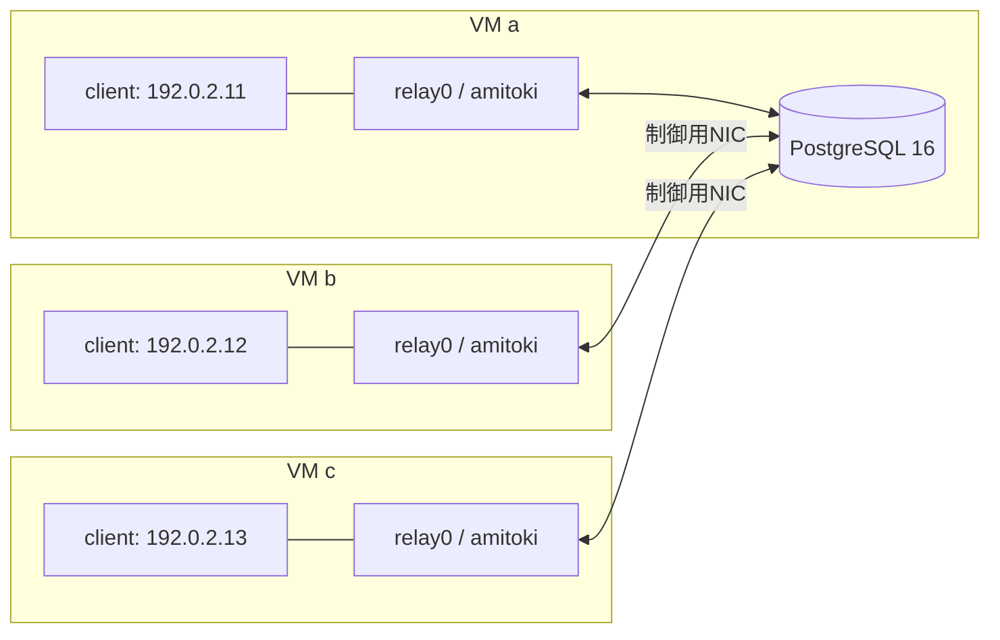

# 3台のVMで中継を試す

`scripts/vm-lab up`でUbuntu 24.04のVMを3台作り、ビルドしたamitokiを配備する。`scripts/vm-lab test`で、VMをまたぐICMP・TCP・UDPと、ノード停止中にDBへ蓄積したフレームの再配送を確認する。

ホストはx86_64 Linux、Python 3.11以降、QEMU/KVMを使う。各VMは2vCPU・2GiBメモリ・12GiBの仮想ディスクを持つ。ディスクは差分形式なので、未使用領域の12GiBを最初から消費しない。

## 中継するLANをVMごとに分ける



各VM内の`client`はnetwork namespaceで、`client0`と`relay0`のvethだけにつながる。VM間を直接結ぶテスト用LANはないため、別VMのclientへ届くにはamitokiの中継が必要になる。PostgreSQLモードはDB経由、P2PモードはQUICで直接送信する。制御用NICはSSH・パッケージ取得・DB/P2P接続に使う。

SSHのホスト側ポートは`127.0.0.1:22221`〜`22223`、DBは`127.0.0.1:25432`。P2PはホストのUDP `127.0.0.1:27441`〜`27443`から各ゲストの7443へ転送する。ポートが使用中なら起動時に失敗する。変更する場合は、ラボを停止して`tests/vm/settings.py`の値を変更する。

VMの接続には[QEMUのuser networkingとhostfwd](https://www.qemu.org/docs/master/system/qemu-manpage.html)を使う。初期設定は[cloud-initのNoCloud](https://docs.cloud-init.io/en/21.3/topics/datasources/nocloud.html)で渡す。イメージは[Ubuntu公式の20260801版](https://cloud-images.ubuntu.com/releases/noble/release-20260801/)に固定し、配布元のSHA256と照合する。

## ホストを準備する

Ubuntu 24.04以降で実行する。Rustは[READMEのビルド手順](../readme.md#ビルドする)に従って導入する。

```bash
sudo apt-get update
sudo apt-get install -y qemu-system-x86 qemu-utils genisoimage python3 curl openssh-client
sudo usermod -aG kvm "$USER"
```

グループを追加した場合はログアウトして入り直す。次の確認が成功すれば、以後のホスト側コマンドにsudoは不要。

```bash
test -r /dev/kvm && test -w /dev/kvm
python3 --version
cargo --version
```

初回は約600MBのイメージ取得とVM内のパッケージ導入を行う。イメージは`~/.cache/amitoki-vm/`、VMの状態はリポジトリ内の`.vm-lab/`に保存する。

## 起動して通信を確かめる

リポジトリのルートで実行する。

```bash
git submodule update --init --recursive
scripts/vm-lab up --relay postgres
scripts/vm-lab status
scripts/vm-lab test --relay postgres
scripts/vm-lab up --relay p2p
scripts/vm-lab test --relay p2p
```

`up`は本体と両プラグインのreleaseビルドを行い、CLI経由でプラグインを配備する。まずDBを持つVM aを準備してからb・cを起動する。再実行すると既存VMへ最新のバイナリを配備し直す。配備中は対象の中継サービスを停止する。DBに残った未処理キューは保持する。

試験はa→b、b→c、c→aで実行する。1472バイトのICMPデータをフラグメント禁止で送信し、TCPで2MiBを転送してSHA256を照合する。UDPは1472バイトを64件ずつ送り、返信が元の内容と一致することを確認する。

停止試験では、VM cの中継サービスを止めてaからUDPを64件送る。DBに未処理データが蓄積し、cの受信アプリには届いていないことを確認する。その後にサービスを起動し、全件の内容とACKによるキューの解消を確認する。試験中のARP再解決はこの試験の対象外なので、この区間だけ宛先MACを固定する。

P2P試験ではPostgreSQLを停止し、DBなしの直接通信を確認する。停止中のデータは送信側のメモリに保持し、相手の再起動後に再送する。送信側自身の強制終了やディスク永続性の保証ではない。CLIで使用中の削除・更新を拒否し、停止中のプラグインを追加削除しても本体SHA256が変わらないこと、ゲストにCargoがないことも検証する。

結果のJSONと各ノードのjournalは`artifacts/vm/<日付>/<時刻>/`へ保存する。失敗時も同じ場所へ記録を残す。

## VMへ入る・停止する・作り直す

```bash
scripts/vm-lab ssh a
# 以下はVM内で実行する
sudo systemctl status amitoki
sudo journalctl -u amitoki -f
sudo ip netns exec client ping 192.0.2.12
```

`exit`でホストへ戻り、必要な操作を実行する。

```bash
scripts/vm-lab down     # OSを終了。ディスクとDBは残す
scripts/vm-lab up       # 再起動して最新版を配備
scripts/vm-lab destroy  # このラボのVM・ディスク・専用鍵を削除
```

`destroy`後も、ダウンロードしたイメージと試験記録は残る。OSの起動に失敗した場合は`.vm-lab/<a|b|c>/serial.log`を確認する。cloud-initの待機期限は10分。パッケージ導入などに失敗したVMは、SSHで原因を確認するか`destroy`後に作り直す。

専用SSH鍵、P2Pのノード別秘密鍵、ランダム生成したDBパスワードは`.vm-lab/`だけへ保存し、Gitから除外する。DB接続はこのローカルラボでは暗号化しない。VM内のamitokiは専用ユーザで動き、raw socketに必要な`CAP_NET_RAW`だけを付ける。

この試験ではvethのchecksum・GSOオフロードを無効にする。raw socketで転送するフレームの内容を検証するための設定であり、物理NICやオフロード有効時の検証は別途必要。処理件数を絞った機能試験なので、この結果を最大帯域の測定値としては扱わない。
